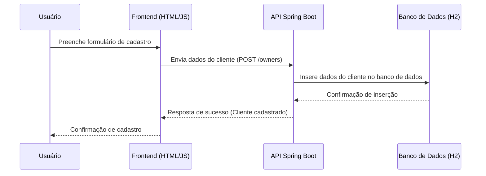
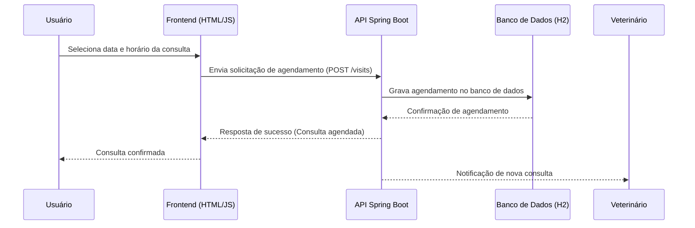
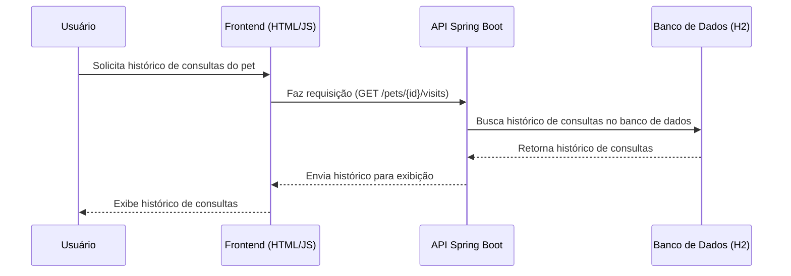
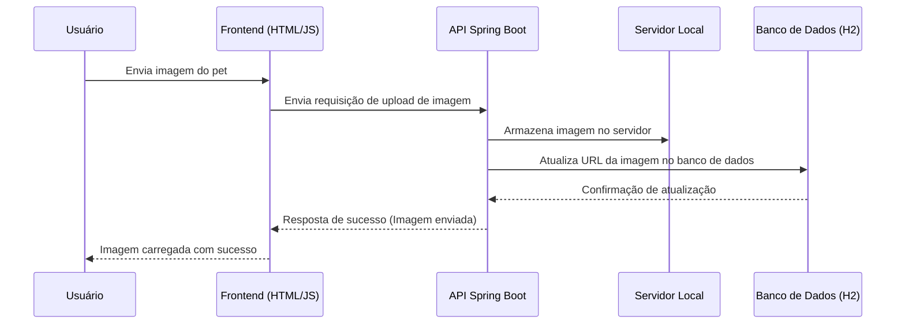
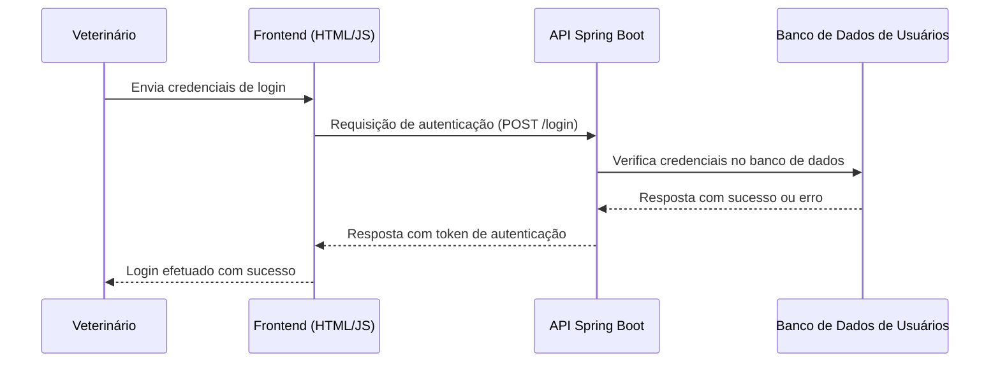
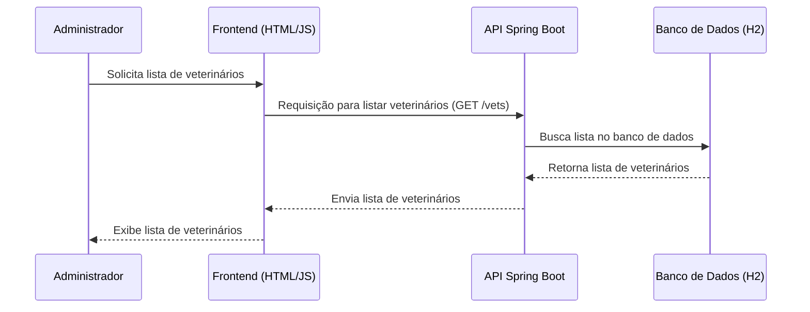

# Guia do Aluno: Modernização do Spring PetClinic com Micro Serviços e Azure

## Introdução ao Spring PetClinic

O **Spring PetClinic** é uma aplicação monolítica desenvolvida em **Java Spring Boot**, que simula o gerenciamento de uma clínica veterinária. A aplicação oferece funcionalidades como cadastro de clientes, veterinários e pets, além de agendamento e histórico de consultas.

### Funcionalidades Principais:
- **Cadastro de Clientes**: Gerencia os dados dos donos dos animais.
- **Cadastro de Veterinários**: Gerencia os dados dos veterinários da clínica.
- **Cadastro de Animais**: Permite o cadastro de pets e associa cada um a um cliente.
- **Consultas**: Permite o agendamento e o acompanhamento de consultas veterinárias.
- **Autenticação**: Veterinários e administradores podem se autenticar para gerenciar as consultas e o sistema.

[(Link para o projeto)](https://github.com/spring-projects/spring-petclinic)

---

## Casos de Uso do Sistema

A seguir estão os principais **casos de uso** da aplicação Spring PetClinic, representados em diagramas. Esses fluxos mostram como as interações entre usuários, API e banco de dados acontecem na arquitetura atual da aplicação.

### Caso de Uso 1: Cadastro de Clientes

---

### Caso de Uso 2: Agendamento de Consulta

---

### Caso de Uso 3: Exibição do Histórico de Consultas

---

### Caso de Uso 4: Upload de Imagem do Pet

---

### Caso de Uso 5: Login de Veterinários

---

### Caso de Uso 6: Gerenciamento de Veterinários

---

## Perguntas para Reflexão

Com base nos casos de uso apresentados e no que você aprendeu sobre **arquitetura em nuvem** e **micro serviços**, responda às seguintes perguntas:

1. **Divisão de Responsabilidades**:
   - Quais partes da aplicação podem ser separadas em micro serviços? Por quê?

2. **Escalabilidade e Resiliência**:
   - Como você pode garantir que a aplicação escale adequadamente com o aumento da demanda?
   - Quais serviços da nuvem poderiam ajudar a garantir alta disponibilidade e resiliência?

3. **Armazenamento de Dados**:
   - Onde e como os dados da aplicação devem ser armazenados para garantir segurança, escalabilidade e acesso rápido?

4. **Automação**:
   - Como você poderia implementar automação de deploy e integração contínua (CI/CD) para melhorar a eficiência no desenvolvimento e nas atualizações da aplicação?

5. **Comunicação entre Serviços**:
   - Se você transformar o sistema em micro serviços, como os diferentes serviços devem se comunicar entre si?
   - Como garantir que a comunicação seja eficiente e segura?

6. **Melhorias no Upload de Arquivos**:
   - Como o armazenamento de imagens e arquivos poderia ser feito de forma mais eficiente utilizando os recursos de nuvem?

7. **Segurança**:
   - Como você garantiria que a comunicação entre os diferentes componentes da aplicação é segura e que o acesso às informações sensíveis está protegido?

8. **Governança e Organização de Recursos**:
   - Como você organizaria os recursos no Azure para manter a governança, separação de responsabilidades e controle de custos?
   - Quais **Resource Groups** criaria e quais serviços incluiria em cada grupo?

9. **Gestão de Identidade e Acesso**:
   - Como você gerenciaria **Identidade e Acesso** utilizando **Azure Active Directory (AD)** e **RBAC (Role-Based Access Control)** para controlar quem pode acessar ou modificar os recursos?
   - Quais grupos AD criaria e quais permissões RBAC atribuiria a eles para gerenciar o acesso de forma segura?

---

Ao responder essas perguntas e refletir sobre os diagramas apresentados, você deverá identificar oportunidades de modernização para transformar o Spring PetClinic em uma aplicação mais eficiente e escalável, utilizando micro serviços e recursos do **Azure**.

---
